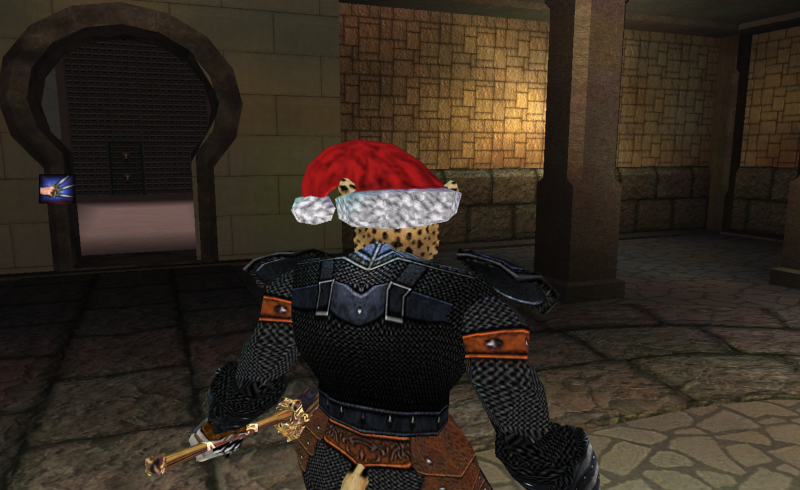

# StrongAuras

Provides an overlay for EverQuest (Uses Direct3D 9 API for the overlay).  This app will tail your character's log file and watch it for triggers.  You can configure what indicators that you are interested in. I will try and check in newer versions of `StrongAuras.exe` but that file may be out of date.  If you wish compile the binary by hand for any reason please follow the instructions below.

Example


### Building

* Install Go
* Install deps via `go get ./...` in the project folder
* Run the build.bat file

### Configuration

Create a `config.json` file in the same folder as StrongAuras.exe.  It should look something like this:

```json
{
    "eq_folder": "C:\\Users\\Public\\Daybreak Game Company\\Installed Games\\EverQuest\\",
    "Character": "Bossman",
    "Server": "mangler",
    "overlay_mode": "window",
    "window_position": {
        "x": 100,
        "y": 100,
        "w": 800,
        "h": 1000
    },
    "indicators": [
        {
            "name": "Theif's eyes",
            "default": true,
            "show_when": "Your battle sense falters",
            "hide_when": "You begin to see the weaknesses in your opponents",
            "x": -0.4,
            "y": 0.4,
            "w": 0.040,
            "h": 0.075,
            "sprite_sheet":"default\\spells01.tga",
            "sprite_box": {
                "x": 0.3137255,
                "y": 0.15686275,
                "w": 0.15686275,
                "h": 0.15686275
            }
        }
    ]
}
```

Settings:

* eq_folder - location on disk where your EverQuest install is located. (note the double slashes)
* Character - Character name that you want to monitor.  This is used to find your log file.
* Server - Server that you play on.  This is also used to find your log file.
* overlay_mode - optional.  If windowed it will not track and size to EverQuest
* window_position - Positioning of the window if overlay_mode is set to window
* indicators - a list of indicators you wish to display
    * name - the name of the indicator.
    * default - `true` means it will show on load, `false` means it will be hidden on load
    * show_when - search text that will toggle the indicator to the visable state. If any log line contains this phrase the indicator will be displayed.
    * hide_when - search text that will toggle the indicator to the hidden state. If any log line contains this phrase the indicator will be hidden.
    * x - x position of the top left corner of your indicator.  The center of the EQ window is 0,0, top left is -1,1.
    * y - y position of the top left corner of your indicator.  The center of the EQ window is 0,0, top left is -1,1.
    * w - the width of the indicator (screen percentage)
    * h - the height of the indicator (screen percentage)
    * sprite_sheet - the EQ `.tga` sprite sheet to use for the indicator.
    * sprite_box - where in the sprite sheet the icon is. The x, y, w, and h values are percentage based.
        * For the EQ spell icons you can start from the top left (0,0 offset).  The images are `0.15686275` by `0.15686275`.  That means if you want the 3rd icon in the 2nd row it would be: 
            * "x": 0.3137255,
            * "y": 0.15686275,
            * "w": 0.15686275,
            * "h": 0.15686275